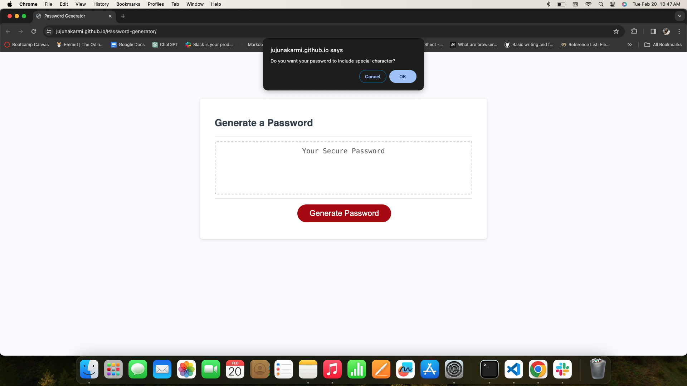
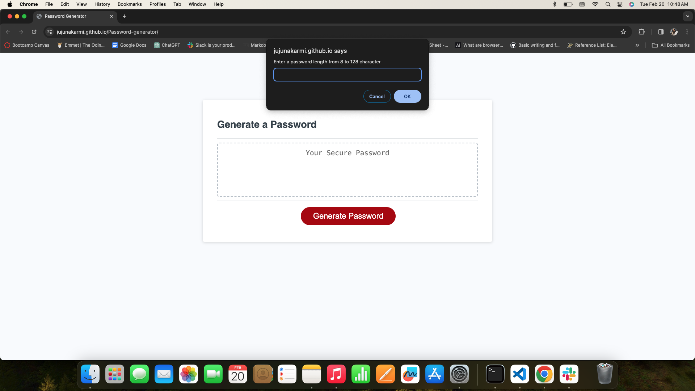
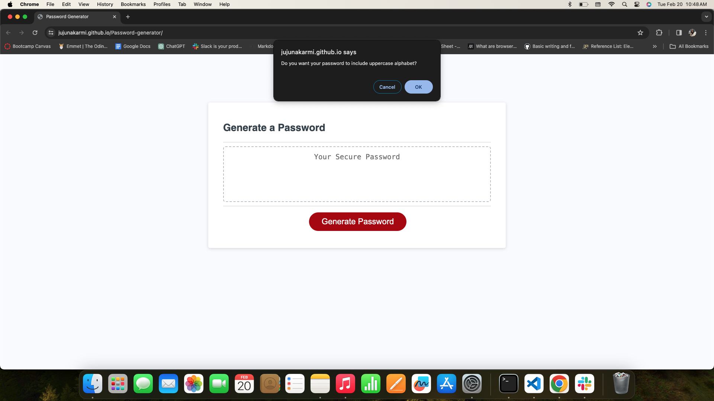
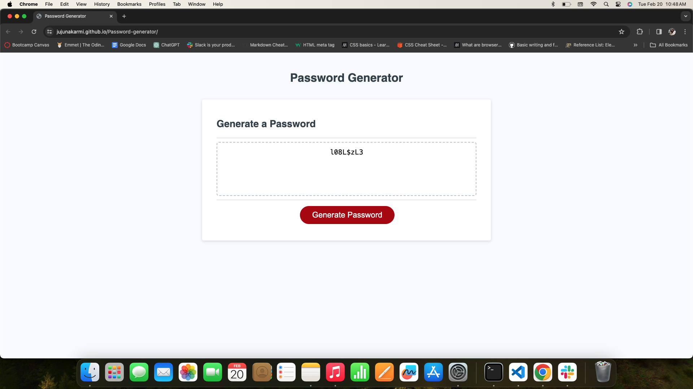

## Password Generator

# Description
This application is very easy to use.It can be used in web browser. It is a random secure password generator application, which will help you to generate random password on your needs. You can select various options which you can select on the prompt, you have option of choosing Sprcial characters, Lower case alphabets, Upper case alphabets and numbers. You also have option of choosing the length of the password as per your need. You can use these random passwords anywhere for wifi passwords, to unlock cellphones or anywhere you want to. This application will provide you strong, random password  for greater security.

You can try password generator: [Click here to try](https://jujunakarmi.github.io/Password-generator/)

Here are some of the screenshots:

# Usage

This password generator is very easy to use. Once you open the application in the web browser, you can click on the generate password,after clicking on the generate password you will get a prompts of choosing of selecting special characters, lowercase alphabets, uppercase alphabets and numbers as well. You should atleast select one criteria at most. Then after choosing  the criteria you want, you can choose how long the length of your password should be. It should be more than 8 characters and upto 128 characters. After you choose the length of you password, it will generate your desired password.

# License
&copy; Copyright 2024 Juju Nakarmi

